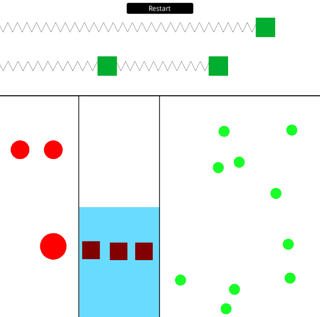

# Physics simulations

This is the second gold achievements for the Maths & Physics class in THUAS'
Game Development & Simulation minor.

## Instructions

Create 4 physics simulations:

- bouncing balls
- objects in a fluid (buoyancy)
- billiard balls
- strings

### Requirements

- Do not use Unity built-in maths/physics components or code
- Ignore air friction
- Assume all collisions are elastic, except one of the bouncing balls

### Result

  
  
<i>Project demo</i>

**Simulations** are isolated from each other, meaning physics calculations are
performed per-simulation.
The movements of each object is affected by a number of **forces**, constant
(such as gravity) or not (response to collisions, buoyancy force, ...).

Collisions between objects are detected thanks to a first pass using **discrete
collision detection** to resolve collisions that may happen in the current frame
(objects overlapping), and if necessary, a second pass using **continuous
collision detection**, to determine **if and when** two objects may collide. If
the collision happens between two frames, colliding objects positions are
interpolated, and won't overlap.  
This process allows for more accurate physics simulations, at the cost of more
calculations. No collision checks pruning technique is used in this project.

## Credits

This project is the work of [Adrien Lucbert](https://github.com/adrienlucbert),
and the Maths & Physics class was given by Rick Appleton.
